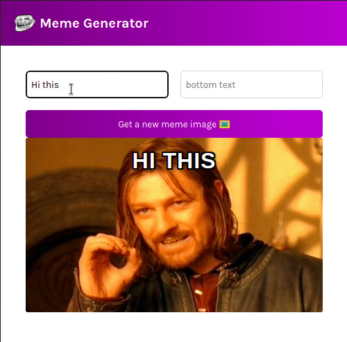

# Create React Meme Generator App
In This project a meme generator app is built using react to Learn various concepts of React.

## Objectives

- [x] States
  - [x] States vs props
  - [x] Best pratices to use states and 
  - [x] UseState Hook
  - [x] Leveling up States to parent component
  - [x] State changes through components and their childern
- [x] Conditional Rendering and different use cases
- [x] Form
  - [x] State and controlled inputs
  - [x] Various iput type like text,checkbox,select list etc.
  - [x] Submit button functioning
- [x] UseEffect
  - [x] useEffect behviour
  - [x] Proper use of dependecies array
  - [x] Memory leaks and cleanup function
  - [x] async funtions in useEffect
  - [x] EventListeners and useEffect

### Demo

### Run App
- $ npm start
- Open [http://localhost:3000](http://localhost:3000) to view it in your browser.
